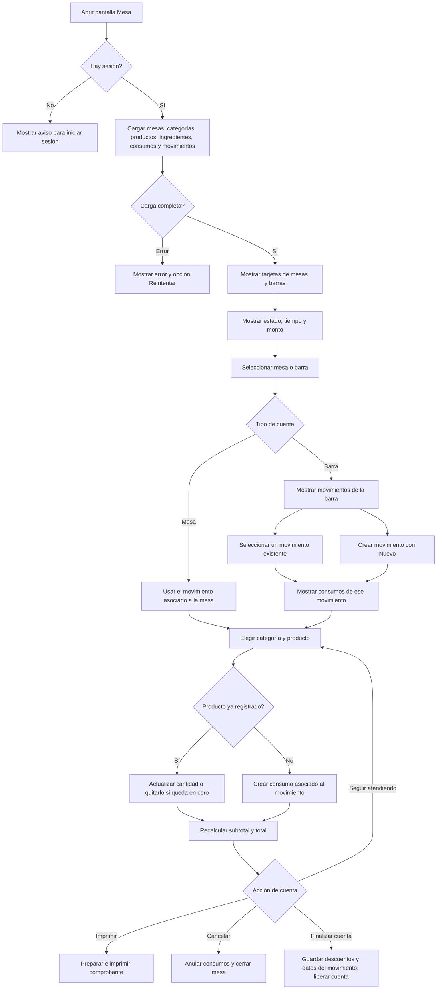

# Flujo de la vista Mesa

La vista está implementada en `src/app/mesa.tsx`. Este documento describe el recorrido desde que se abre la pantalla hasta que una cuenta se guarda, se imprime o se cierra.

## Diagrama general

## Lo que se ve en pantalla

- **Lista inicial:** cada tarjeta muestra el estado, el tiempo desde `hora_inicio` y el importe. En una mesa, el importe corresponde a su movimiento asociado; en una barra, suma los movimientos asociados.
- **Tiempo:** se calcula usando `hora_inicio` y la pantalla refresca el reloj cada 30 segundos.
- **Cuenta de mesa:** usa el `id_mov` asociado directamente a la mesa.
- **Cuenta de barra:** presenta sus movimientos en tarjetas. Al seleccionar una, los productos, propina, domicilio y total pertenecen a ese movimiento. **Nuevo** crea otro movimiento para la barra.

## Registro de productos

1. Se elige una categoría y se ajusta la cantidad del producto.
2. Si el producto requiere preparación, se pueden configurar ingredientes y opciones.
3. Al guardar, una línea existente del mismo producto se actualiza; si la cantidad queda en cero, se elimina. Si no existe, se crea un consumo vinculado al movimiento seleccionado.
4. El subtotal se forma con las líneas de consumo y sus descuentos. El total suma subtotal, propina y domicilio.

## Acciones de la cuenta

- **Imprimir:** genera el comprobante con productos y totales.
- **Cancelar:** pide confirmación, anula los consumos y cierra la mesa o barra.
- **Finalizar cuenta:** persiste los descuentos; en barra actualiza el movimiento seleccionado. Después envía la cuenta al backend para liberar la mesa o barra y vuelve a cargar los datos.

## Endpoints principales

| Uso | Endpoint |
| --- | --- |
| Cargar mesas | `GET /mesas/` |
| Cargar catálogos y relaciones | `GET /categorias/`, `GET /productos/`, `GET /ingredientes/`, `GET /producto-ingredientes/` |
| Cargar consumos y movimientos | `GET /mesasC/`, `GET /movimientos/` |
| Activar una mesa o barra | `PATCH /mesas/{id}/estado?new_state=true` |
| Crear movimiento de barra | `POST /movimientos/` |
| Crear, editar o eliminar consumo | `POST /mesasC/`, `PUT /mesasC/{id}`, `DELETE /mesasC/{id}` |
| Actualizar movimiento seleccionado | `PUT /movimientos/{id}` |
| Finalizar o cerrar cuenta | `POST /mesas/{id}/finalizar`, `PATCH /mesas/{id}/cerrar` |
